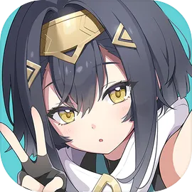
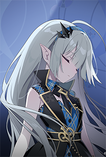
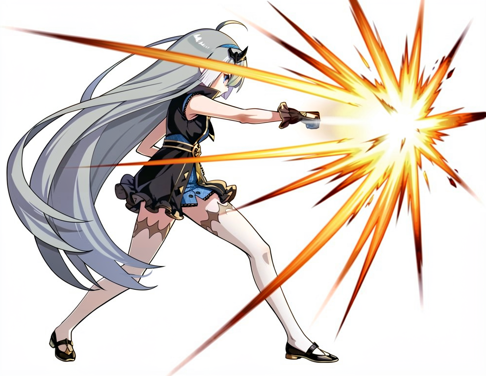
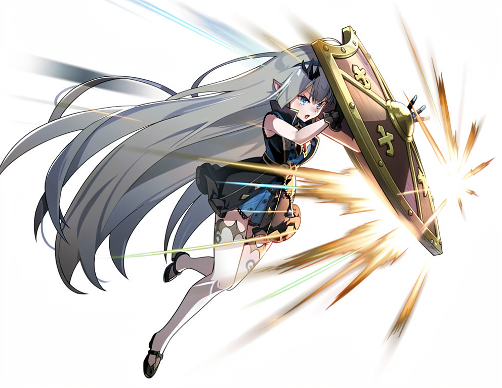
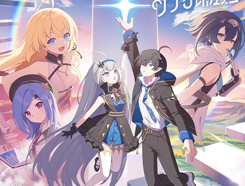
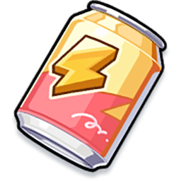

**🌐 语言 / Language：** 简体中文 · [English](#english-version)

<div align="center">



# 杀戮星塔 · SlayTheStella

**《Slay the Spire 2》的《星塔旅人》（Stella Sora / ステラソラ）同人 Mod**

塔的另一端，是那座曾被她统治的星塔。这一次，轮到「魔王」亲自爬塔了。

[](https://github.com/SinonJZH/slay-the-stella)
[](SlayTheStella.json)
[](LICENSE)
[](https://godotengine.org/)
[](SlayTheStella.csproj)
[](https://github.com/BAKAOLC/STS2-RitsuLib)
[](SlayTheStella/localization)

</div>

> [!WARNING]
> 项目处于 **0.0.0 早期开发阶段**。当前角色与卡牌多为原型与占位内容，效果、数值与资源随时可能大改，请勿将其视为最终成品。
>
> 本Readme文件由AI生成，由于项目在快速开发阶段，Readme中内容并非最新状态。

---

## 📖 这是什么

以手游《星塔旅人》为题材的《Slay the Spire 2》（杀戮尖塔 2）同人 Mod。Mod 把星塔世界观中最具压迫感的存在——**魔王（The Tyrant）**——做成了一位可供游玩的角色，并逐步将星塔的「音符」「秘纹」「协奏」等设定移植为杀戮尖塔 2 的卡牌机制。

当前实现基于 [STS2.RitsuLib](https://github.com/BAKAOLC/STS2-RitsuLib) 脚手架，代码统一使用 RitsuLib 的 **AutoRegistration 自动注册** 特性组织，并提供简中 / 英文 / 日文三语本地化。

## ✨ 当前内容一览

| 类别 | 数量 | 说明                                                         |
| --- | --- |--------------------------------------------------------------|
| 👑 角色 | 1 | 「魔王」MoWang（The Tyrant），可用角色                       |
| 🎴 卡牌 | 4 | 初始卡 3 张 + 测试卡 1 张（试作「协奏」/「秘纹」关键词系统） |
| 📿 遗物 | 1 | 「维塔」Vita（初始遗物，占位）                               |
| 🧪 药水 | 1 | 「罐装干劲汽水」                                             |
| 🎵 自定义机制 | 1 套 | 13 种「音符」次级资源 + 战斗内音符面板（NoteUI）             |

## 👑 角色：魔王（MoWang）

她是星塔的统治者，官方角色编号 **NO.000**、定位 **BOSS**。在这个 Mod 里，她走下王座，成为你卡组的主人。



| 项目 | 内容 |
| --- | --- |
| 角色 ID / 英文名 | `MoWang` / The Tyrant |
| 性别 | 女 |
| 初始生命 / 金币 | 99 / 99 |
| 主题色 | `#00468E`（深星蓝） |
| 初始卡组 | 打击 ×5、防御 ×5、星光的印记 ×1 |
| 初始遗物 | 维塔 Vita |
| 自定义能量图标 | `energy_mowang.png`（卡牌与能量表盘专用） |

> [!NOTE]
> 角色名与设定取材自《星塔旅人》官方资料；术语的中/英/日译名对照见仓库内 `_manual/stella-sora-glossary.md`。

## 🎴 卡牌

### 初始卡组

<div align="center">





</div>

| 卡牌 | 类型 | 费用 | 效果                                                                         |
| --- | --- | --- |------------------------------------------------------------------------------|
| **打击** `MwStrike` | 攻击 | 1 | 造成 5 点伤害。**[协奏]**：持有满足条件的音符时，追加 1 点伤害               |
| **防御** `MwDefend` | 技能 | 1 | 获得 5 点格挡。**[协奏]**：持有满足条件的音符时，追加 1 点格挡               |
| **星光的印记** `MwTracesOfStarlight` | 技能 | 2 | 获得 9 点格挡与 4 点活力。**[秘纹]**：打出后收集音符。升级：格挡 +4、活力 +2 |

### 其他

| 卡牌 | 类型 | 费用 | 效果 |
| --- | --- | --- | --- |
| **测试卡牌** `MwTestCard` | 攻击 | 1 | 对目标造成 2 点伤害，再对所有敌人造成 1 点伤害（开发/测试用，后续可能移除） |

## 📿 遗物

| 遗物 | 稀有度 | 说明 |
| --- | --- | --- |
| **维塔** `Vita` | 普通 | 初始遗物。开发中，暂无效果 |
| | | *「您的命令就是我的意志。」* |

> 维塔（Vita / ヴェータ）在《星塔旅人》中是魔王的专属私人秘书，本 Mod 以遗物形式将其作为魔王的伴身物品占位。

## 🧪 药水

| 药水 | 稀有度 | 效果 |
| --- | --- | --- |
| **罐装干劲汽水** `MwCannedVigorSoda` | 普通 | 战斗中回复 3 点能量 |



## 🎵 玩法机制

将《星塔旅人》的「音符」体系移植为杀戮尖塔 2 的**次级资源（Secondary Resource）**，作为魔王卡组的核心资源：

- **13 种「之音」音符**：强攻 Pummel、幸运 Luck、暴发 Burst、体力 Stamina、专注 Focus、技巧 Skill、绝招 Ultimate、火 Ignis、水 Aqua、风 Ventus、地 Terra、光 Lux、暗 Umbra。
- **[秘纹] Disc 卡**：打出后收集指定音符（如「星光的印记」）。
- **[协奏] Harmony 卡**：当玩家持有的音符满足卡面需求时，触发追加效果（如「打击」的追加伤害）；满足条件时卡牌会泛金提示。
- **战斗内音符面板（NoteUI）**：通过 RitsuLib 次级资源注册表挂载到战斗 UI，实时展示 13 种音符的持有数量与增减变化（场景 `SlayTheStella/ui/NoteUI.tscn`、`NoteCardUI.tscn`）。

关键词与音符均有独立图标（位于 `SlayTheStella/images/icons/`），卡牌、遗物、关键词描述全部走本地化键，便于三语同步维护。

## 🛠️ 技术栈

| 层 | 选型 |
| --- | --- |
| 引擎 / 渲染 | Godot 4.5.1（Mono / C#，`rendering_method=mobile`） |
| 语言 | C# 13（.NET 9，`net9.0`，Nullable 开启） |
| 脚手架 | [STS2.RitsuLib](https://github.com/BAKAOLC/STS2-RitsuLib) 0.5.15（AutoRegistration 自动注册、`ModCharacterTemplate`、`DamageCmd` 等） |
| 游戏引用 | `sts2.dll`、`0Harmony.dll`（引用游戏本体安装目录，不随 Mod 打包） |
| 音频 | FMOD Studio 2.03（bank 由代码加载播放，见「🎧 FMOD 音频工程」） |
| 本地化 | `localization/{zhs,eng,jpn}/`，默认简中，JSON 均为无 BOM UTF-8 |

## 🚀 安装（玩家）

> 本 Mod 仍在开发中，暂未发布正式 Release，以下为通用安装方式。

1. 确保已安装 **STS2-RitsuLib**（依赖版本 ≥ `0.5.14`），游戏版本 ≥ `0.111.0`。
2. 将构建产物 `SlayTheStella.dll`、`SlayTheStella.json` 与 `SlayTheStella.pck` 放入游戏目录下的 `mods/SlayTheStella/` 文件夹：
   ```
   <Slay the Spire 2 安装目录>/
   └── mods/
       └── SlayTheStella/
           ├── SlayTheStella.dll
           ├── SlayTheStella.json
           └── SlayTheStella.pck
   ```
3. 想抢先体验最新开发版，也可直接到 GitHub Releases 的 [`dev-latest`](https://github.com/SinonJZH/slay-the-stella/releases/tag/dev-latest) 下载：该 Release 由 GitHub Actions 在每次推送到 `main` 时自动构建并覆盖，始终对应最新提交。下载 `SlayTheStella.zip` 解压，把其中的 `SlayTheStella` 文件夹复制到游戏 `mods/` 目录即可（效果与上面手动放置三件套相同；仅供体验，不保证稳定）。

## 🔨 从源码构建（开发者）

> 更详细的图文环境配置教程见仓库 submodule `_manual/SlayTheSpire2ModdingTutorials/Basics/01 - 环境配置/`（初始化后即可查阅）。

### 环境要求

- [Godot **4.5.1 stable mono**](https://godotengine.org/download/archive/4.5.1-stable/)（《杀戮尖塔 2》同款版本；下载时务必选 **.NET** 版，渲染器保持 `Mobile` 与游戏一致）
- [.NET 9 SDK](https://dotnet.microsoft.com/zh-cn/download)（项目为 `net9.0` / C# 13；装了 .NET 10 若遇问题请切回 9）
- IDE：**Rider**（推荐，可用其 `Publish` 一键完成 dll + pck 构建；VS Code 需装 `C# Dev Kit` 等插件，Visual Studio 亦可）
- 已安装《Slay the Spire 2》本体（编译需引用其 `sts2.dll` / `0Harmony.dll`，构建产物自动复制进它的 `mods/` 目录）
- 依赖 `STS2.RitsuLib` 由 NuGet 自动还原，无需手动准备

### 步骤

0. （可选）克隆后如需在本地查阅官方教程与 RitsuLib 源码，初始化参考资料 submodule：
   ```
   git submodule update --init --recursive
   ```
   `_manual/` 仅供查阅（已被 `.csproj` 排除出编译），不初始化也不影响构建。
1. 复制路径配置模板并填写本机路径：
   ```
   copy SlayTheStellaPath.csproj.example SlayTheStellaPath.csproj
   ```
   `SlayTheStellaPath.csproj`（含本机路径，已被 `.gitignore` 排除、不会误提交）中需设置两个变量：
   - `Sts2Dir`：游戏安装目录（编译时引用 `sts2.dll`，构建后自动复制产物）
   - `GodotExe`：Godot mono 可执行文件路径（用于导出 PCK）
2. 构建。**推荐**在 Rider 中执行 **Publish**（`Release` / `ExportRelease` 配置），它会依次完成：
   - `PostBuild`：编译 `SlayTheStella.dll`，并把 `dll`、`json` 复制到 `<Sts2Dir>/mods/SlayTheStella/`；
   - `Publish` 后自动调用 Godot（`--headless --export-pack "Windows Desktop"`）导出 `SlayTheStella.pck` 到同一目录。
   不使用 Rider 时，终端执行 `dotnet publish` 可达到相同效果（两个 Target 的触发点一致）；只想重编代码、不动资源时，`dotnet build` 即可（仅复制 dll/json，速度快）。
3. 启动游戏，首次会询问是否启用 Mod，确认后游戏重启一次；右下角出现“已加载模组”、角色选择界面出现「魔王」即成功（玩家侧安装布局见上文）。

### 产物说明

- `mods/SlayTheStella/` 下的三件套：`dll`（代码）、`pck`（素材资源）、`json`（mod 清单，必需）。
- **只改代码**：重新 `build` / `Publish` 即可，无需重打 pck；**改了素材**（图片/场景/音频 bank）才需要重新导出 pck。
- 需要兼容 mac 时：把 `export_presets.cfg` 中 `binary_format/architecture="x86_64"` 改为 `"msil"`（本 Mod 面向 Windows，一般无需处理）。

> [!TIP]
> 本项目源码内图片等资源属第三方素材（见下），从源码构建仅用于个人/非营利开发测试。

## 🎧 FMOD 音频工程

音频走《杀戮尖塔 2》同款 **FMOD Studio** 管线：素材在 FMOD 工程（`FMod/`，工程格式 Studio 2.03）中编排并构建为 bank，随资源打进 pck，运行时由代码注册加载（见下）。

### 当前状态：占位工程

- `FMod/` 目前**尚未开始音频开发**：工程内只有空的 `Master` bank 与目录骨架（`STS2.fspro` + `Metadata/`），不含任何 event、素材与可听内容。
- 仓库随附的 `SlayTheStella/audios/`（`GUIDs.txt` + `desktop/*.bank`）是早期构建留下的**占位产物**，仅保证「代码注册 → pck 打包 → 运行时加载」整条链路可用，实际音频为后续 TODO。

### 自定义音频（供贡献者）

1. 安装 [FMOD Studio](https://www.fmod.com/download#fmodstudio) 2.03 及以上（官方教程建议与游戏一致的 2.03.06），打开 `FMod/STS2.fspro`。
2. 在 `Assets` 导入音频素材；在 `Banks` 新建自己的 bank（**不要改动 `Master`**）；在 `Events` 新建 event 并右键 `Assign To Bank` 指向自己的 bank。
3. 经 `Window → Mixer Routing` 将 event 挂到与原版一致的总线下（如 `master/sfx`、`master/music`），使游戏内音量/混响设置生效；再在 event 的 sheet 中编排（timeline 拼接、multi instrument 随机触发等）。
4. `File → Build` 构建 bank，随后 `File → Export GUIDs` 导出 `GUIDs.txt`。
5. 产物放置：bank 需落到代码注册路径——`SlayTheStella/audios/desktop/*.bank`，`GUIDs.txt` 放 `SlayTheStella/audios/`（`desktop` 为平台子目录，详见下方「构建输出目录」）。`export_presets.cfg` 已通过 include 过滤（`*.bank`、`*/GUIDs.txt`）保证这些文件被打进 pck。
6. 代码侧无需改动：`AudioUtils.Init()`（由 `Entry.Init` 调用）已用 `FmodStudioDeferredBankRegistration.RegisterBank(...)` / `RegisterStudioGuidMappings(...)` 注册上述两处；播放时用 `SfxCmd.Play("event:/...")` 或 `DamageCmd.Attack(...).WithHitFx(sfx: "event:/...")`。细节见官方教程 `_manual/SlayTheSpire2ModdingTutorials/RitsuLib/01 - 添加基础内容/10 - 添加音频/`。

> [!NOTE]
> FMOD Studio 的 bank 输出目录（`Edit → Preferences → Build…` → *Built banks output directory*）自 1.07 起**保存在工程内**（`FMod/Metadata/Workspace.xml` 的 `builtBanksOutputDirectory`），随仓库提交、全组共享，且支持相对路径。本项目约定输出到仓库内 `SlayTheStella/audios/`（相对 `FMod/` 即 `../SlayTheStella/audios`），构建后自然得到 `audios/desktop/*.bank` 与 `audios/GUIDs.txt` 的布局。

## 🤖 AI 辅助开发

本仓库为 AI 编程助手（如 GitHub Copilot、Cursor、Claude Code 等）辅助开发做了专门准备：

- **AGENTS.md**：仓库根目录提供一份与代码保持同步的项目说明，覆盖项目结构、构建/部署方式、代码约定（AutoRegistration 注册模式、本地化键格式、资源路径约定等）以及本地资料检索顺序。AI 助手会自动读取该文件，可直接基于它参与开发，无需另行询问项目概况。
- **反编译源码目录 `_manual/sts2_export/`**：该目录是 AGENTS.md 中约定的《Slay the Spire 2》反编译源码位置（由游戏本体 `sts2.dll` 等反编译而来，内含 `sts2.sln`），供 AI 助手在开发时查询游戏本体 API 与类型签名。此目录**已被 `.gitignore` 排除、不随仓库提交**，克隆后默认不存在；如使用 AI 辅助开发，可自行在本地准备该目录（路径约定见 AGENTS.md），其内容不会进入仓库。

## 🗂️ 目录结构

```
slay-the-stella/
├── Scripts/                  # C# 源码（编译进 DLL）
│   ├── Entry.cs              # Mod 入口（[ModInitializer]）
│   ├── MoWang/               # 角色「魔王」：角色、卡池、卡片、遗物、药水、抽象模型
│   ├── Shared/               # 共享逻辑：卡牌模型抽象层、关键词、音符次级资源（ResNotes）
│   ├── UI/                   # 战斗内 NoteUI / NoteCardUI 节点脚本
│   └── Utils/                # 常量 / 日志 / 本地化 / 设置页 / 音频 / 数据存取
├── SlayTheStella/            # Godot 资源（随 PCK 打包）
│   ├── ui/                   # Godot 场景（.tscn）
│   ├── localization/         # 本地化 JSON（zhs / eng / jpn）
│   ├── images/               # 角色 / 卡牌 / 遗物 / 药水 / 图标素材
│   ├── audios/               # FMOD bank 占位产物（详见「FMOD 音频工程」）
│   └── mod_image.png         # Mod 图标
├── FMod/                     # FMOD Studio 音频工程（占位，尚未开发）
├── _manual/                  # 内部参考资料（教程/库 submodule、术语表；sts2_export/ 为本地反编译源码，已被 .gitignore 忽略）
├── project.godot
├── SlayTheStella.csproj      # 项目文件（含自动复制到游戏 mods 目录的 Target）
├── SlayTheStella.json        # Mod 清单
└── export_presets.cfg        # Godot 导出预设
```

## 🌐 本地化

本地化采用「目录按语言、文件按类型」的组织方式：

```
SlayTheStella/localization/
├── zhs/  cards.json · potions.json · relics.json · characters.json   # 简体中文（默认）
├── eng/  …                                                            # English
├── jpn/  …                                                            # 日本語
└── settings/  zhs.json · eng.json · jpn.json                          # Mod 设置页
```

键名遵循 `SLAY_THE_STELLA_{CATEGORY}_{NAME}.{field}` 约定（如 `SLAY_THE_STELLA_CARD_MW_STRIKE.title`），卡牌数值通过 `DynamicVar`（如 `{Damage:diff()}`）动态注入描述文本。新增内容时请同步补齐三语。

## 📄 许可与版权

- **原创代码与文档**（`Scripts/`、`SlayTheStella/ui/`、`SlayTheStella/localization/`、项目配置等）：以 **MIT License** 授权，Copyright (c) 2026 SinonJZH。详见 [LICENSE](LICENSE)。
- **第三方素材**（`SlayTheStella/images/`、`SlayTheStella/audios/`）：取自悠星（Yostar, Inc.）《星塔旅人》（ステラソラ），版权归悠星所有，仅依其[官方二创指南](https://stellasora.jp/agreement)在非营利范围内使用，**不随本项目代码再授权**。
- **分发条款**：作为《Slay the Spire 2》Mod，遵循 [Mega Crit 内容政策](https://www.megacrit.com/content-policy/)——免费提供、禁止付费墙与变相变现；本项目与 Mega Crit、悠星均无官方隶属或背书关系。

## 🙏 致谢

- [STS2-RitsuLib](https://github.com/BAKAOLC/STS2-RitsuLib) —— Mod 脚手架与自动注册基础设施
- 《Slay the Spire 2》官方 Mod 教程（仓库内 `_manual/SlayTheSpire2ModdingTutorials`）
- 悠星《星塔旅人》（ステラソラ）与所有玩家——感谢这个美丽的星塔世界

---

## English Version

> [!NOTE]
> The Simplified Chinese text above is the original, authoritative version of this README; this English section is a translation for convenience and may lag behind during active development.

> [!WARNING]
> The project is in its **0.0.0 early-development stage**. The current character and cards are mostly prototypes and placeholders — effects, numbers and assets may change drastically, so please do not treat them as the final product.
>
> This README is AI-generated. Since the project is under rapid development, the content here may not reflect the latest state.

### 📖 What Is This

A fan mod for *Slay the Spire 2*, themed around the mobile game *Stella Sora* (星塔旅人 / ステラソラ). The mod turns the most oppressive presence in the Star Tower universe — **the Tyrant (MoWang)** — into a playable character, gradually porting Star Tower systems such as Notes (音符), Disc (秘纹) and Harmony (协奏) into card mechanics of *Slay the Spire 2*.

The current implementation is built on the [STS2.RitsuLib](https://github.com/BAKAOLC/STS2-RitsuLib) scaffolding; the codebase is organized around RitsuLib's **AutoRegistration** attributes and ships trilingual localization (Simplified Chinese / English / Japanese).

### ✨ Current Content

| Category | Count | Details |
| --- | --- | --- |
| 👑 Characters | 1 | MoWang (The Tyrant), playable character |
| 🎴 Cards | 4 | 3 starter cards + 1 test card (prototyping the Harmony / Disc keyword systems) |
| 📿 Relics | 1 | Vita (starter relic, placeholder) |
| 🧪 Potions | 1 | Canned Vigor Soda |
| 🎵 Custom mechanics | 1 set | 13 kinds of Notes as secondary resources + in-combat Notes panel (NoteUI) |

### 👑 The Character: MoWang (The Tyrant)

She is the ruler of the Star Tower, official character **NO.000** with the role of **BOSS**. In this mod, she steps down from the throne and becomes the master of your deck.


| Item | Value |
| --- | --- |
| Character ID / English name | `MoWang` / The Tyrant |
| Gender | Female |
| Starting HP / Gold | 99 / 99 |
| Theme color | `#00468E` (deep star blue) |
| Starter deck | 5× Strike, 5× Defend, 1× Traces of Starlight |
| Starter relic | Vita |
| Custom energy icon | `energy_mowang.png` (used on cards and the energy orb) |

> [!NOTE]
> The character name and setting are based on the official materials of *Stella Sora*; the CN/EN/JP term glossary lives in `_manual/stella-sora-glossary.md` in this repo.

### 🎴 Cards

#### Starter Deck

<div align="center">


</div>

| Card | Type | Cost | Effect                                                                                              |
| --- | --- | --- |-----------------------------------------------------------------------------------------------------|
| **Strike** `MwStrike` | Attack | 1 | Deal 5 damage. **[Harmony]**: deal 1 additional damage when you hold the Notes required by the card |
| **Defend** `MwDefend` | Skill | 1 | Gain 5 Block. **[Harmony]**: gain 1 additional Block when you hold the Notes required by the card   |
| **Traces of Starlight** `MwTracesOfStarlight` | Skill | 2 | Gain 9 Block and 4 Vigor. **[Disc]**: collect Notes after playing. Upgraded: Block +4, Vigor +2     |

#### Others

| Card | Type | Cost | Effect |
| --- | --- | --- | --- |
| **Test Card** `MwTestCard` | Attack | 1 | Deal 2 damage to the target, then 1 damage to ALL enemies (for development/testing; may be removed later) |

### 📿 Relics

| Relic | Rarity | Description |
| --- | --- | --- |
| **Vita** `Vita` | Common | Starter relic. Under development, no effect yet. |
| | | *“Your command is my will.”* |

> Vita (Vita / ヴェータ) is the Tyrant's dedicated private secretary in *Stella Sora*; this mod features her as a companion item — the Tyrant's starter relic — as a placeholder.

### 🧪 Potions

| Potion | Rarity | Effect |
| --- | --- | --- |
| **Canned Vigor Soda** `MwCannedVigorSoda` | Common | Gain 3 Energy during combat |


### 🎵 Gameplay Mechanics

The Note system from *Stella Sora* is ported into *Slay the Spire 2* as a **secondary resource**, forming the core resource of the Tyrant's deck:

- **13 kinds of “Notes”**: Pummel, Luck, Burst, Stamina, Focus, Skill, Ultimate, Ignis, Aqua, Ventus, Terra, Lux, Umbra.
- **[Disc] cards**: collect the Notes shown on the card after playing it (e.g. Traces of Starlight).
- **[Harmony] cards**: when the Notes you hold meet the card's requirement, trigger a bonus effect (e.g. Strike's bonus damage); the card glows gold while the requirement is met.
- **In-combat Notes panel (NoteUI)**: mounted on the combat UI through the RitsuLib secondary-resource registry, showing the held amount of each of the 13 Notes and their changes in real time (scenes `SlayTheStella/ui/NoteUI.tscn`, `NoteCardUI.tscn`).

Keywords and Notes each have dedicated icons (under `SlayTheStella/images/icons/`); card, relic and keyword descriptions all go through localization keys, so all three languages stay in sync.

### 🛠️ Tech Stack

| Layer | Choice |
| --- | --- |
| Engine / Rendering | Godot 4.5.1 (Mono / C#, `rendering_method=mobile`) |
| Language | C# 13 (.NET 9, `net9.0`, Nullable enabled) |
| Scaffolding | [STS2.RitsuLib](https://github.com/BAKAOLC/STS2-RitsuLib) 0.5.15 (AutoRegistration, `ModCharacterTemplate`, `DamageCmd`, etc.) |
| Game references | `sts2.dll`, `0Harmony.dll` (referenced from the game install directory; not packaged with the mod) |
| Audio | FMOD Studio 2.03 (banks loaded and played by code; see “🎧 FMOD Audio Project”) |
| Localization | `localization/{zhs,eng,jpn}/`, default Simplified Chinese; all JSON files are UTF-8 without BOM |

### 🚀 Installation (Players)

> This mod is still under development and no official Release has been published; the following is the generic install method.

1. Make sure **STS2-RitsuLib** (dependency version ≥ `0.5.14`) and game version ≥ `0.111.0` are installed.
2. Put the build outputs `SlayTheStella.dll`, `SlayTheStella.json` and `SlayTheStella.pck` into the `mods/SlayTheStella/` folder of the game directory:
   ```
   <Slay the Spire 2 install dir>/
   └── mods/
       └── SlayTheStella/
           ├── SlayTheStella.dll
           ├── SlayTheStella.json
           └── SlayTheStella.pck
   ```

### 🔨 Building from Source (Developers)

> A more detailed illustrated environment-setup tutorial lives in the repo submodule `_manual/SlayTheSpire2ModdingTutorials/Basics/01 - 环境配置/` (available after initializing it).

#### Environment Requirements

- [Godot **4.5.1 stable mono**](https://godotengine.org/download/archive/4.5.1-stable/) (the same version as *Slay the Spire 2*; be sure to download the **.NET** build and keep the renderer on `Mobile` to match the game)
- [.NET 9 SDK](https://dotnet.microsoft.com/zh-cn/download) (`net9.0` / C# 13; if you have .NET 10 installed and hit issues, switch back to 9)
- IDE: **Rider** (recommended — its `Publish` builds both dll and pck in one step; for VS Code, install extensions such as `C# Dev Kit`; Visual Studio also works)
- A local install of *Slay the Spire 2* (compilation references its `sts2.dll` / `0Harmony.dll`; build outputs are auto-copied into its `mods/` directory)
- The `STS2.RitsuLib` dependency is restored automatically via NuGet — nothing to prepare manually

#### Steps

0. (Optional) To browse the official tutorials and RitsuLib sources locally after cloning, initialize the reference submodules:
   ```
   git submodule update --init --recursive
   ```
   `_manual/` is for reference only (already excluded from compilation in `.csproj`); building works fine without initializing it.
1. Copy the path-config template and fill in your local paths:
   ```
   copy SlayTheStellaPath.csproj.example SlayTheStellaPath.csproj
   ```
   `SlayTheStellaPath.csproj` (holds local paths; excluded via `.gitignore`, so it won't be committed) needs two variables:
   - `Sts2Dir`: the game install directory (references `sts2.dll` when compiling; build outputs are auto-copied afterwards)
   - `GodotExe`: path to the Godot mono executable (used to export the PCK)
2. Build. **Recommended**: run **Publish** in Rider (the `Release` / `ExportRelease` configurations). It completes, in order:
   - `PostBuild`: compiles `SlayTheStella.dll` and copies the `dll` and `json` into `<Sts2Dir>/mods/SlayTheStella/`;
   - after `Publish`, automatically invokes Godot (`--headless --export-pack "Windows Desktop"`) to export `SlayTheStella.pck` to the same directory.
   Without Rider, running `dotnet publish` in a terminal achieves the same result (both Targets trigger the same way); to recompile code only without touching assets, `dotnet build` suffices (copies just dll/json; fast).
3. Start the game. The first launch asks whether to enable the mod, and the game restarts once. When the “mod loaded” notice appears at the bottom right and the **Tyrant** shows up on the character-select screen, the mod is working (see the player-side install layout above).

#### Output Artifacts

- The three files under `mods/SlayTheStella/`: `dll` (code), `pck` (assets), `json` (mod manifest; required).
- **Code-only changes**: re-run `build` / `Publish` — no need to rebuild the pck. **Asset changes** (images / scenes / audio banks) require re-exporting the pck.
- mac support, if ever needed: change `binary_format/architecture="x86_64"` to `"msil"` in `export_presets.cfg` (this mod targets Windows; usually no action is needed).

> [!TIP]
> Assets such as the images in this repo are third-party material (see below); building from source is intended for personal / non-profit development and testing only.

### 🎧 FMOD Audio Project

Audio follows the same **FMOD Studio** pipeline as *Slay the Spire 2*: assets are arranged and built into banks in the FMOD project (`FMod/`, project format Studio 2.03), shipped into the pck with the resources, and registered/loaded at runtime by code (see below).

#### Current Status: Placeholder Project

- `FMod/` has **not started audio development yet**: the project only contains an empty `Master` bank and a directory skeleton (`STS2.fspro` + `Metadata/`) — no events, assets or audible content.
- The bundled `SlayTheStella/audios/` (`GUIDs.txt` + `desktop/*.bank`) is a **placeholder artifact** left from an earlier build: it only keeps the whole pipeline (code registration → pck packaging → runtime loading) working. Actual audio is a later TODO.

#### Custom Audio (for Contributors)

1. Install [FMOD Studio](https://www.fmod.com/download#fmodstudio) 2.03 or newer (the official tutorial suggests 2.03.06, matching the game), and open `FMod/STS2.fspro`.
2. Import audio assets under `Assets`; create your own bank under `Banks` (**don't touch `Master`**); create an event under `Events`, right-click it and choose `Assign To Bank` to point it at your bank.
3. Route the event to the same bus as the vanilla game (e.g. `master/sfx`, `master/music`) via `Window → Mixer Routing` so the in-game volume/reverb settings take effect; then arrange it in the event sheet (timeline assembly, multi-instrument random triggers, etc.).
4. `File → Build` to build the bank, then `File → Export GUIDs` to export `GUIDs.txt`.
5. Output placement: banks must land at the code-registered path — `SlayTheStella/audios/desktop/*.bank` — and `GUIDs.txt` goes in `SlayTheStella/audios/` (`desktop` is the platform subdirectory; see “build output directory” below). `export_presets.cfg` already includes these files in the pck via include filters (`*.bank`, `*/GUIDs.txt`).
6. No code changes needed: `AudioUtils.Init()` (called by `Entry.Init`) registers both locations with `FmodStudioDeferredBankRegistration.RegisterBank(...)` / `RegisterStudioGuidMappings(...)`; play audio with `SfxCmd.Play("event:/...")` or `DamageCmd.Attack(...).WithHitFx(sfx: "event:/...")`. Details in the official tutorial `_manual/SlayTheSpire2ModdingTutorials/RitsuLib/01 - 添加基础内容/10 - 添加音频/`.

> [!NOTE]
> FMOD Studio's bank output directory (`Edit → Preferences → Build…` → *Built banks output directory*) has been **stored inside the project** since 1.07 (`builtBanksOutputDirectory` in `FMod/Metadata/Workspace.xml`), so it is committed with the repo, shared by the whole team, and supports relative paths. This project outputs to `SlayTheStella/audios/` inside the repo (i.e. `../SlayTheStella/audios` relative to `FMod/`), which naturally yields the `audios/desktop/*.bank` and `audios/GUIDs.txt` layout after building.

### 🤖 AI-Assisted Development

This repo is prepared for AI coding assistants (such as GitHub Copilot, Cursor and Claude Code):

- **AGENTS.md**: a project guide at the repo root, kept in sync with the code, covering project structure, build/deploy workflow, code conventions (the AutoRegistration pattern, localization key format, resource path conventions, etc.) and the local reference search order. AI assistants read it automatically and can start contributing based on it directly, without asking for a project overview.
- **Decompiled-source directory `_manual/sts2_export/`**: the location agreed in AGENTS.md for the decompiled *Slay the Spire 2* sources (decompiled from the game's `sts2.dll` etc., containing `sts2.sln`), where AI assistants look up vanilla APIs and type signatures during development. This directory is **excluded via `.gitignore` and not committed**; it does not exist after a fresh clone. For AI-assisted development, you can prepare it locally (path conventions in AGENTS.md); its content never enters the repo.

### 🗂️ Directory Structure

```
slay-the-stella/
├── Scripts/                  # C# sources (compiled into the DLL)
│   ├── Entry.cs              # Mod entry point ([ModInitializer])
│   ├── MoWang/               # The “Tyrant” character: character, pools, cards, relics, potions, abstract models
│   ├── Shared/               # Shared logic: card model abstraction, keywords, Note secondary resources (ResNotes)
│   ├── UI/                   # In-combat NoteUI / NoteCardUI node scripts
│   └── Utils/                # Constants / logging / localization / settings page / audio / data storage
├── SlayTheStella/            # Godot resources (packed into the PCK)
│   ├── ui/                   # Godot scenes (.tscn)
│   ├── localization/         # Localization JSON (zhs / eng / jpn)
│   ├── images/               # Character / card / relic / potion / icon assets
│   ├── audios/               # FMOD bank placeholder artifacts (see “FMOD Audio Project”)
│   └── mod_image.png         # Mod icon
├── FMod/                     # FMOD Studio audio project (placeholder, not developed yet)
├── _manual/                  # Internal references (tutorial/library submodules, glossary; sts2_export/ is local decompiled source, gitignored)
├── project.godot
├── SlayTheStella.csproj      # Project file (contains Targets that auto-copy into the game's mods directory)
├── SlayTheStella.json        # Mod manifest
└── export_presets.cfg        # Godot export presets
```

### 🌐 Localization

Localization is organized as “one directory per language, one file per type”:

```
SlayTheStella/localization/
├── zhs/  cards.json · potions.json · relics.json · characters.json   # Simplified Chinese (default)
├── eng/  …                                                            # English
├── jpn/  …                                                            # 日本語
└── settings/  zhs.json · eng.json · jpn.json                          # Mod settings pages
```

Keys follow the `SLAY_THE_STELLA_{CATEGORY}_{NAME}.{field}` convention (e.g. `SLAY_THE_STELLA_CARD_MW_STRIKE.title`); card numbers are injected into description text dynamically via `DynamicVar` (e.g. `{Damage:diff()}`). When adding new content, please fill in all three languages.

### 📄 License & Copyright

- **Original code and documentation** (`Scripts/`, `SlayTheStella/ui/`, `SlayTheStella/localization/`, project config, etc.): licensed under the **MIT License**, Copyright (c) 2026 SinonJZH. See [LICENSE](LICENSE).
- **Third-party assets** (`SlayTheStella/images/`, `SlayTheStella/audios/`): taken from *Stella Sora* (ステラソラ) by Yostar, Inc.; copyright belongs to Yostar. They are used only for non-profit purposes per its [official fan-content guidelines](https://stellasora.jp/agreement) and are **not re-licensed** along with this project's code.
- **Distribution terms**: as a *Slay the Spire 2* mod, this project follows [Mega Crit's content policy](https://www.megacrit.com/content-policy/) — provided for free, no paywalls or indirect monetization. This project has no official affiliation with or endorsement from Mega Crit or Yostar.

### 🙏 Acknowledgements

- [STS2-RitsuLib](https://github.com/BAKAOLC/STS2-RitsuLib) — the mod scaffolding and AutoRegistration infrastructure
- The official *Slay the Spire 2* modding tutorials (in-repo `_manual/SlayTheSpire2ModdingTutorials`)
- Yostar's *Stella Sora* (ステラソラ) and all its players — thank you for this beautiful Star Tower world
